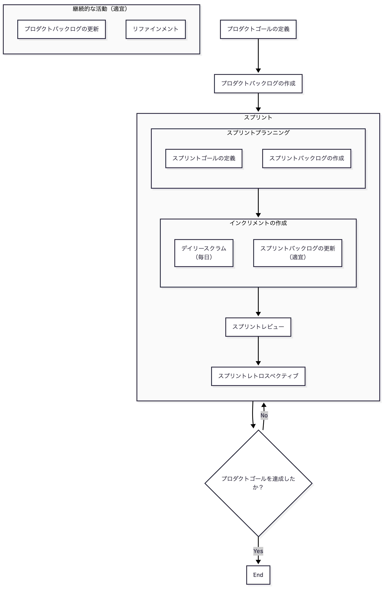

## アジャイル開発とは

アジャイル開発とは、変化に対応しながら、価値のあるソフトウェアを継続的に届けることを重視する、ソフトウェア開発における価値観や行動原則などのマインドセットです。

### なぜアジャイル開発なのか

アジャイル開発が必要とされる背景には、ビジネスと IT システムの関係の変化があります。

#### 従来のビジネスとシステム

従来は、業務を効率的に処理したり、正確に記録したりするためのシステムが多くありました。

例えば、会計、人事、在庫管理、販売管理などの業務を支援するシステムです。

このようなシステムでは、要求が比較的明確で、必要な機能を事前に定義しやすいという特徴があります。

そのため、何を作るかを事前に決め、計画に沿って開発を進めやすいという特徴があります。

#### 現在のビジネスとシステム

一方、現在では、新しいサービスを作ったり、顧客体験を改善したり、業務そのものを変革したりするなど、システムがビジネスそのものに関わることが増えています。

このような取り組みでは、開発を始める時点で、要求をすべて明確にすることが難しい場合があります。

実際にサービスを作ってユーザーに使ってもらうことで初めて分かることがあったり、開発の途中で顧客の要求や市場の状況が変化したりするためです。

そのため、何を作るべきかを事前に決めきることが難しく、計画通りに開発を進めるだけでは対応しにくい場合があります。

#### 変化に対応するために

このようなビジネスでは、最初にすべてを決めて計画通りに開発するのではなく、開発を進めながら得られた情報をもとに、作るものや進め方を変えていく必要があります。

こうした、変化や不確実性を前提として、状況に応じて開発の方向を調整しながら、価値のあるソフトウェアを継続的に届けていく考え方が、アジャイル開発です。

## スクラムとは

スクラムとは、アジャイルの考え方を実践するためのフレームワークの一つです。

### 基本的な考え方

スクラムでは、「透明性・検査・適応」という考え方を重視します。

- 透明性：現在の状況や問題を、チームで把握できるようにする
- 検査：プロダクトの進捗や方向性、開発の進め方などを定期的に確認する
- 適応：検査によって問題や改善点が見つかった場合に、やり方を変える

スクラムでは、透明性を高めて現在の状況を把握し、検査によって問題や変化を確認し、必要に応じて適応することを繰り返しながら開発を進めます。

このサイクルを繰り返すことで、状況の変化を踏まえて、プロダクトの価値につながる判断や調整を行いやすくなります。また、問題や望ましくない変化にも早期に対応できるため、問題が大きくなることを防ぎやすくなります。

### 開発の概要

  

スクラムでは、プロダクトゴールに向けて、スプリントという一定期間の開発を繰り返します。

まず、プロダクトが目指す将来の状態をプロダクトゴールとして定めます。

その実現に必要なことをプロダクトバックログにまとめ、スプリントプランニングで今回のスプリントで達成する目標や取り組む項目を決めます。

スプリント中は開発を進めながら、デイリースクラムで状況を確認し、必要に応じて計画を調整します。

スプリントの終わりには、スプリントレビューで作成したインクリメントを確認し、プロダクトの今後について検討します。

その後、スプリントレトロスペクティブで開発の進め方を振り返り、次のスプリントに向けて改善します。

この流れを繰り返しながら、プロダクトゴールの達成を目指します。

各要素の詳細などについては、別途[スクラムの詳細](scrum-details.md)に整理しています。

## 所感

スクラムの各要素のつながりやプロダクトの価値を高めるための具体的な行動については、まだ十分に理解できていないことも多いと感じています。

まずは基本的な考え方を理解した上で、実践しながら少しずつ理解を深めていければと思います。

## 参考

- [スクラムガイド](https://scrumguides.org/docs/scrumguide/v2020/2020-Scrum-Guide-Japanese.pdf)
- [アジャイルソフトウェア開発宣言の読みとき方](https://www.ipa.go.jp/digital/hjuojm000000gwod-att/000065601.pdf)
- [SCRUM BOOT CAMP THE BOOK](https://amzn.asia/d/01yEbWi6)
